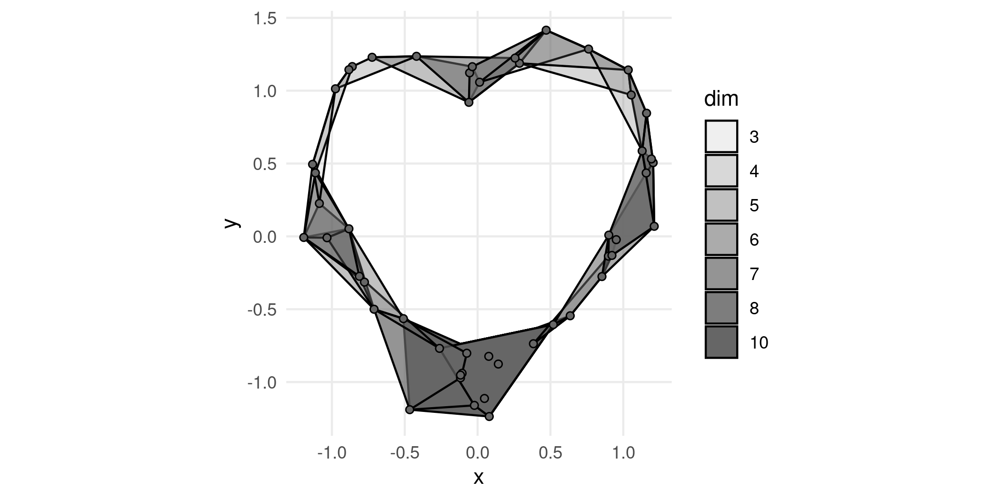
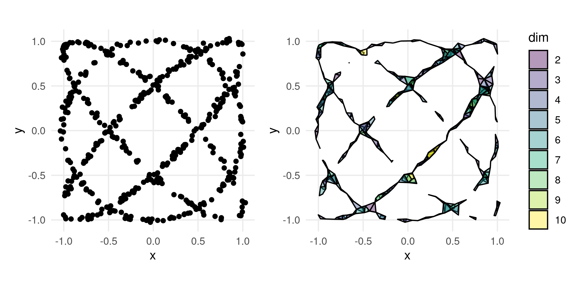
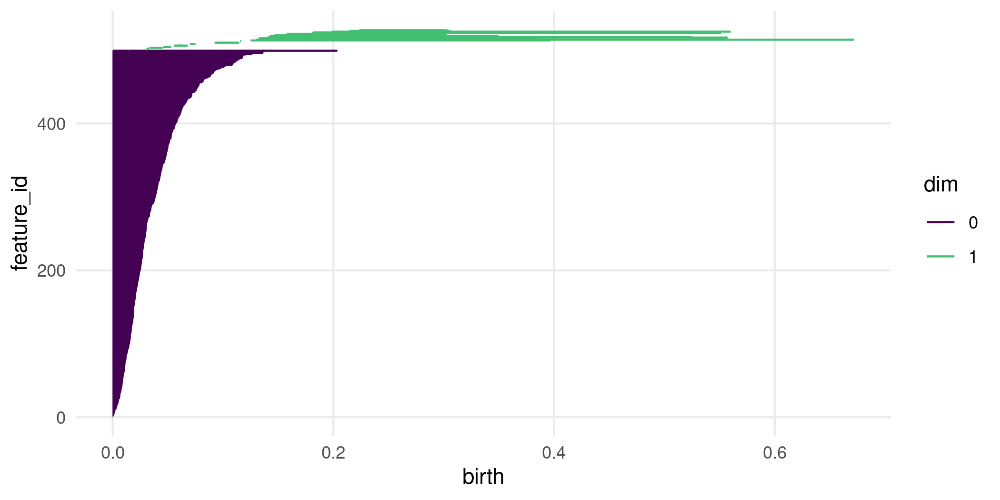

<!-- README.md is generated from README.Rmd. Please edit that file -->

# TDAvis 

<!-- badges: start -->

[](https://github.com/jamesotto852/TDAvis/actions/workflows/R-CMD-check.yaml)
[](https://cran.r-project.org/package=TDAvis)
[](Redirect-URL)
<!-- badges: end -->

**TDAvis** extends [**ggplot2**](https://github.com/tidyverse/ggplot2)
for visualizing common tools from [Topological Data
Analysis](https://en.wikipedia.org/wiki/Topological_data_analysis)
(TDA). The visualization of Rips complexes is implemented with
`geom_simplicial_complex()`. Persistence homologies can be visualized
via either barcode charts or persistence diagrams with `geom_barcode()`
or `geom_persistence()`, respectively.

## Installation

You can install the development version of TDAvis from
[GitHub](https://github.com/) with:

``` r
# install.packages("remotes")
remotes:install_github("jamesotto852/TDAvis")
```

## Simplicial Complexes

Let’s consider a simple data set to illustrate the use of these tools:

``` r
library("ggplot2")

glimpse(df)
#> Rows: 50
#> Columns: 2
#> $ x <dbl> 0.14236715, -0.05976043, -0.10641715, -0.77666623, -0.05489406, 0.85…
#> $ y <dbl> -0.876380809, 0.920098191, -0.939728919, -0.314141159, 1.122565159, …

ggplot(df, aes(x, y)) +
  geom_point() +
  coord_fixed()
```


For details on how `df` was created, see the section on generating data
with [**algstat**](https://github.com/dkahle/algstat) at the end of this
document.

In TDA, it is very common to create a [simplicial
complex](https://en.wikipedia.org/wiki/Abstract_simplicial_complex)
based on point cloud data. These complexes have well-defined
[topological features](https://en.wikipedia.org/wiki/Betti_number) which
may relate back to the probability structure governing the sample of
points. Informally, the topological features of interest correspond to
holes of various dimensions (or more accurately, to “cycles”).

Typically, the [Rips
complex](https://en.wikipedia.org/wiki/Vietoris%E2%80%93Rips_complex) is
used as it is relatively simple to compute. Loosely, the Rips complex
identifies groups of

points that are all within a pairwise distance of each other as
")-dimensional
simplexes. In **TDAvis**, `geom_simplicial_complex()` plots the Rips
complex for a 2-dimensional data set given a value of `radius`:

``` r
library("TDAvis")

ggplot(df, aes(x, y)) +
  geom_simplicial_complex(radius = .4) +
  coord_fixed()
```



Notice, the object in the plot above clearly has a “hole”. This kind of
insight is one of the main motivators of TDA. We’ll see more formal ways
of identifying relevant features like this after we discuss persistent
homology in the next section.

By default, the dimension of each simplex is communicated via opactiy
(the `alpha` aesthetic). In the next example, we’ll see how this is
useful when plotting data with multiple groups. However, when we’re just
interested in one complex it can be helpful to instead map the computed
variable `dim` to the `fill` aesthetic, setting `alpha`
:

``` r
ggplot(df, aes(x, y)) +
  geom_simplicial_complex(
    mapping = aes(fill = after_stat(dim)),
    alpha = .5, radius = .4
  ) +
  coord_fixed()
```


### Plotting multiple groups

Now, we’ll look at `df_groups`. This data is similar to `df`, but now
with two labeled groups, `a` and `b`:

``` r
glimpse(df_groups)
#> Rows: 100
#> Columns: 3
#> $ x   <dbl> -0.05067197, 1.51263915, 0.67222711, -0.11922006, 0.65633027, 0.31…
#> $ y   <dbl> -0.5825551, 1.0206963, 0.3998390, 1.2577820, -0.1532893, 1.2202389…
#> $ lab <chr> "a", "b", "a", "b", "a", "b", "a", "b", "a", "b", "a", "b", "a", "…

ggplot(df_groups, aes(x, y, fill = lab)) +
  geom_point(shape = 21) +
  coord_fixed()
```


It is simple to plot the Rips complexes for multiple groups by mapping
to the `fill` aesthetic:

``` r
ggplot(df_groups, aes(x, y, fill = lab)) +
  geom_simplicial_complex(radius = .4) +
  coord_fixed()
```


It is also possible to use the `fill` aesthetic to visualize the simplex
dimensions. Typically, faceting the resulting plot is a good idea:

``` r
ggplot(df_groups, aes(x, y)) +
  geom_simplicial_complex(
    mapping = aes(fill = after_stat(dim)),
    alpha = .5, radius = .4
  ) +
  facet_wrap(vars(lab), ncol = 1) +
  coord_fixed()
```


------------------------------------------------------------------------

In each example so far, the plots have depended heavily on the choice of
`radius`. In reality, we tend to be interested in considering the
topological features of complexes generated by all reasonable values of
`radius`. The gif below illustrates this point, observe how features
appear and disappear in each of the subplots as the “bubbles” increase
in size.


This is what motivates the tools of [persistent
homology](https://en.wikipedia.org/wiki/Persistent_homology)!

## Perstistent Homology

In the above animation, we see the structure of the Rips complexes
change as the radii increase. For example, in the top right plot we see
two disconnected components that last a couple of seconds. In the bottom
right plot, the central hole is present for almost the entire animation.
In the first plot, we see quite a few short-lived holes, but overall
there are no features that persist for more than a few frames.

Intuitively, when the difference in “time” between a topological
feature’s birth and death is larger, that is an indication that the
feature might be important. A way to visualize the persistence of
topological features are barcode charts. Each feature is plotted as a
horizontal line, marking its birth and death in terms of the value of
the Rips complex’s diameter parameter.

Below, we have plotted the barcode chart for `df` using
`geom_barcode()`.

``` r
ggplot() +
  geom_barcode(point_cloud = df) +
  scale_color_viridis_d(end = .7)
```


Notice the single long-lived feature, the one dimensional hole. This
corresponds to the feature we observed previously, with
`geom_simplicial_complex()`!

Another way to plot persistent homologies is persistence diagrams, in
which topological features are plotted as points with
")
values correspond to their birth and death times:

``` r
ggplot() +
  geom_persistence(point_cloud = df) +
  geom_abline() +
  scale_color_viridis_d(end = .7)
```


Again, we see the single significant one-dimensional feature—the hole!

In both of these examples, we haven’t supplied anything to the `data`
argument of `ggplot()`. Instead, we set `point_cloud = df` in each
`geom_` function. These functions are similar to `geom_function()` in
that they do not require any aesthetics and can create plots with the
default value of `data = NULL`. However, there is another way to supply
data via aesthetic mappings: the `point_data` aesthetic.

### The `point_data` aesthetic

Both `geom_barcode()` and `geom_persistence()` accept the optional
`point_data` aesthetic. This aesthetic is different from the typical
**ggplot2** aesthetics—it needs to be pointing at a list column with
`data.frame` elements. For example, see how we construct `df_nested`:

``` r
library("tidyverse")

df_nested <-
  df_groups |>
  group_by(lab) |>
  nest()

df_nested
#> # A tibble: 2 × 2
#> # Groups:   lab [2]
#>   lab   data             
#>   <chr> <list>           
#> 1 a     <tibble [50 × 2]>
#> 2 b     <tibble [50 × 2]>
```

This approach allows for easy faceting. See below how we plot barcode
charts for each group in `df_group`:

``` r
ggplot(df_nested) +
  geom_barcode(aes(point_data = data)) +
  facet_wrap(vars(lab), ncol = 1) +
  scale_color_viridis_d(end = .7)
```


Similarly, we can plot multiple persistence diagrams:

``` r
ggplot(df_nested) +
  geom_persistence(aes(point_data = data)) +
  geom_abline() +
  facet_wrap(vars(lab)) +
  scale_color_viridis_d(end = .7)
```


Note: either the `point_data` aesthetic *or* the `point_cloud` argument
**must** be specified. Also, if the `point_data` aesthetic is mapped to,
it is important that each group of the data only correspond to one row
in `data`. This can be acheived via faceting or mapping to aesthetics
like `color` or `linetype`.

## Generating Data

As mentioned previously, the data sets used in this document have been
generated via [**algstat**](https://github.com/dkahle/algstat).
Specifically, they were sampled via `algstat::rvnorm()` which samples
from a normal distribution centered on a
[variety](https://en.wikipedia.org/wiki/Algebraic_variety) (loosely, the
zero level set of a polynomial).

In the case of `df` and `df_groups`, the data corresponds to the variety
of
 = (x^2 + y^2 - 1)^3 - x^2 y^3"):

``` r
set.seed(0)

p <- mp("(x^2 + y^2 - 1)^3 - x^2 y^3")

df <- rvnorm(500, p, .04, "tibble", chains = 8) |>
  slice_sample(n = 50) |> # downsampling for "thinning"
  select(x, y)

df_groups <- 
  rvnorm(500, p, .04, "tibble", chains = 8) |>
  slice_sample(n = 100) |>
  select(x, y) |>
  mutate(
    x = x + rep(c(-.5, .5), length.out = 100),
    lab = rep(c("a", "b"), length.out = 100)
  )
```

The variety we have been considering is relatively simple. For a more
interesting example, we can consider a polynomial whose variety is a
[Lissajous curve](https://en.wikipedia.org/wiki/Lissajous_curve):

``` r
library("patchwork")
set.seed(1)

df_lissajous <- rvnorm(500, lissajous(3, 3,  0, 0), .014, "tibble", chains = 8) |>
  select(x, y) |>
  slice_sample(n = 500)
#> Compiling model... done.

p_scatterplot <- 
  ggplot(df_lissajous, aes(x, y)) +
  geom_point() +
  coord_fixed()

p_complex <- 
  ggplot(df_lissajous, aes(x, y)) +
  geom_simplicial_complex(
    aes(fill = after_stat(dim)), alpha = .4,
    diameter = .12, zero_skeleton = FALSE) +
  coord_fixed()

p_scatterplot + p_complex
```



``` r
ggplot() +
  geom_persistence(point_cloud = df_lissajous) +
  geom_abline() +
  scale_color_viridis_d(end = .7)
```


``` r

ggplot() +
  geom_barcode(point_cloud = df_lissajous) +
  scale_color_viridis_d(end = .7)
```



<!-- Potential includes: -->
<!-- - Algstat data -->
<!-- - Related projects -->
<!-- - What's coming section -->
<!--    - Persistence w/ CI -->
<!--    - Other complexes for geom_simplicial_complex() -->
